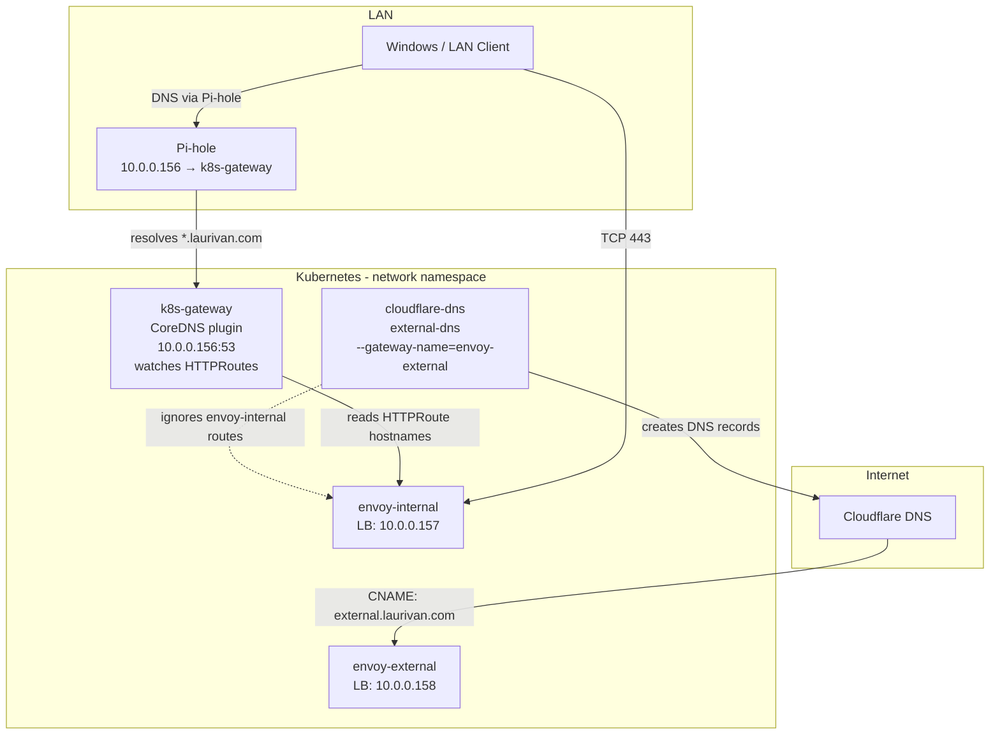
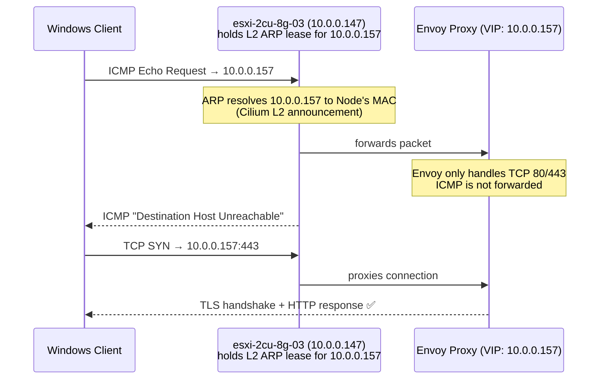

# FAQ: Internal Services Not Accessible via `envoy-internal`

> **Symptoms**: A service exposed via `envoy-internal` is unreachable from LAN clients even though the Flux HelmRelease, HTTPRoute, and pods all appear healthy.

---

## How Internal DNS Works in This Cluster

This cluster uses two separate ingress paths and two separate DNS mechanisms:



| Gateway | DNS mechanism | Accessible from |
|---|---|---|
| `envoy-external` | `cloudflare-dns` (external-dns) pushes records to Cloudflare | Internet + LAN |
| `envoy-internal` | `k8s-gateway` (CoreDNS) serves DNS at `10.0.0.156` | LAN only (via Pi-hole conditional forwarding) |

> **Key insight**: `cloudflare-dns` runs with `--gateway-name=envoy-external`, so it **only** creates Cloudflare DNS records for routes attached to `envoy-external`. Routes on `envoy-internal` are handled exclusively by `k8s-gateway` — no Cloudflare involvement.

---

## Issue 1: k8s-gateway Fails to Watch HTTPRoutes After Restart

### Root Cause

At cluster startup, `k8s-gateway` can fail to initialize its `HTTPRoute` controller due to a transient API server connection reset:

```
[WARNING] plugin/k8s_gateway: error getting crd httproutes.gateway.networking.k8s.io,
  error: unexpected error when reading response body. Please retry.
  Original error: read tcp ...: connection reset by peer
```

When this happens, `k8s-gateway` falls back to only watching `Service` resources, returning `NXDOMAIN` for **all** internal hostnames — even ones that were previously working.

### Diagnosis

```bash
# Check if k8s-gateway has HTTPRoute controller initialized
kubectl logs -n network -l app.kubernetes.io/name=k8s-gateway | grep -E "HTTPRoute|error"

# Test DNS resolution directly against k8s-gateway
dig +short myservice.laurivan.com @10.0.0.156
```

If `dig` returns empty and logs show the HTTPRoute controller error, proceed to the fix.

### Fix

Restart the `k8s-gateway` deployment to force a clean re-initialization:

```bash
kubectl rollout restart deployment/k8s-gateway -n network
kubectl rollout status deployment/k8s-gateway -n network
```

After rollout, confirm all controllers initialized successfully:

```bash
kubectl logs -n network -l app.kubernetes.io/name=k8s-gateway | grep "controller initialized"
# Expected output:
# [INFO] plugin/k8s_gateway: GatewayAPI controller initialized
# [INFO] plugin/k8s_gateway: HTTPRoute controller initialized
# [INFO] plugin/k8s_gateway: Service controller initialized
```

Verify DNS resolves:

```bash
dig +short myservice.laurivan.com @10.0.0.156
# Should return 10.0.0.157 (envoy-internal LB IP)
```

---

## Issue 2: New Internal Service Has No DNS Record

### Root Cause

A new HTTPRoute attached to `envoy-internal` is not picked up by `k8s-gateway` after the restart (or `k8s-gateway` is healthy but the route was added after a long-running session). This can also happen if `k8s-gateway` was never restarted after a CRD re-sync.

In contrast to `envoy-external` routes (handled automatically by `cloudflare-dns`), `envoy-internal` routes require `k8s-gateway` to be running and watching HTTPRoutes correctly.

### Diagnosis

```bash
# Does the HTTPRoute exist and is it accepted?
kubectl get httproute -A
kubectl describe httproute <name> -n <namespace>

# Does DNS resolve?
dig +short <hostname>.laurivan.com @10.0.0.156

# Are the pods healthy?
kubectl get pods -n <namespace>
```

### Fix

If the HTTPRoute exists and is `Accepted` but DNS doesn't resolve, restart `k8s-gateway` (see Issue 1 above).

---

## Issue 3: Pi-hole Conditional Forwarding Not Configured

For LAN clients to resolve internal hostnames, Pi-hole must forward `laurivan.com` queries to `k8s-gateway` at `10.0.0.156`.

### Setup

In Pi-hole → **Settings → DNS → Conditional Forwarding**:

| Field | Value |
|---|---|
| Local network CIDR | `10.0.0.0/24` |
| Router / DNS IP | `10.0.0.156` |
| Local domain name | `laurivan.com` |

> Without this, LAN clients will resolve `*.laurivan.com` via public Cloudflare DNS, which has no records for `envoy-internal` services.

---

## Diagnosing "Destination Host Unreachable" from a LAN Client

When you `ping` an internal service VIP (e.g. `10.0.0.157`), you may see:

```
Reply from 10.0.0.147: Destination host unreachable.
```

**This is normal and not an error.** Here's why:



- `10.0.0.147` is the **cluster node** (`esxi-2cu-8g-03`) holding the Cilium L2 ARP announcement lease for `10.0.0.157` — it is not a router.
- Envoy Gateway only listens on TCP 80/443. ICMP ping packets are not handled, so the node's kernel returns "host unreachable".
- **Use `curl` instead of `ping` to verify connectivity:**

```bash
# Should return HTTP 200
curl -sk -o /dev/null -w "%{http_code}" https://myservice.laurivan.com

# Or directly by IP with a Host header
curl -sk -o /dev/null -w "%{http_code}" https://10.0.0.157 -H "Host: myservice.laurivan.com"
```

---

## Adding a New Service on `envoy-internal`

### How to expose a service internally (no public DNS)

1. In your HelmRelease (or a standalone `HTTPRoute`), set `parentRefs` to `envoy-internal` in the `network` namespace:

```yaml
route:
  app:
    hostnames: ["myservice.${SECRET_DOMAIN}"]
    parentRefs:
      - name: envoy-internal
        namespace: network
        sectionName: https
    rules:
      - backendRefs:
          - identifier: app
            port: 80
```

2. Ensure your Flux `Kustomization` has `postBuild.substituteFrom` set so `${SECRET_DOMAIN}` is substituted:

```yaml
postBuild:
  substituteFrom:
    - name: cluster-secrets
      kind: Secret
```

3. After Flux reconciles, `k8s-gateway` will automatically pick up the new HTTPRoute and start serving DNS for `myservice.laurivan.com` → `10.0.0.157`.

4. No `DNSEndpoint` CRD or Cloudflare changes are needed — `k8s-gateway` handles it.

> **Do NOT** add a `DNSEndpoint` pointing `myservice.laurivan.com` → `internal.laurivan.com`. That would push the record to public Cloudflare DNS, exposing an internal service to the internet.

---

## Quick Diagnostic Checklist

```bash
# 1. Is the pod running?
kubectl get pods -n <namespace>

# 2. Is the HTTPRoute accepted?
kubectl get httproute -n <namespace> -o yaml | grep -A5 "status:"

# 3. Does k8s-gateway resolve the hostname?
dig +short <hostname>.laurivan.com @10.0.0.156

# 4. Is the k8s-gateway HTTPRoute controller active?
kubectl logs -n network -l app.kubernetes.io/name=k8s-gateway | grep -E "HTTPRoute|error|NXDOMAIN"

# 5. Can you reach the service on TCP?
curl -sk -o /dev/null -w "%{http_code}" https://<hostname>.laurivan.com

# 6. Is the Cilium L2 lease active?
kubectl -n kube-system get lease | grep l2announce
```
