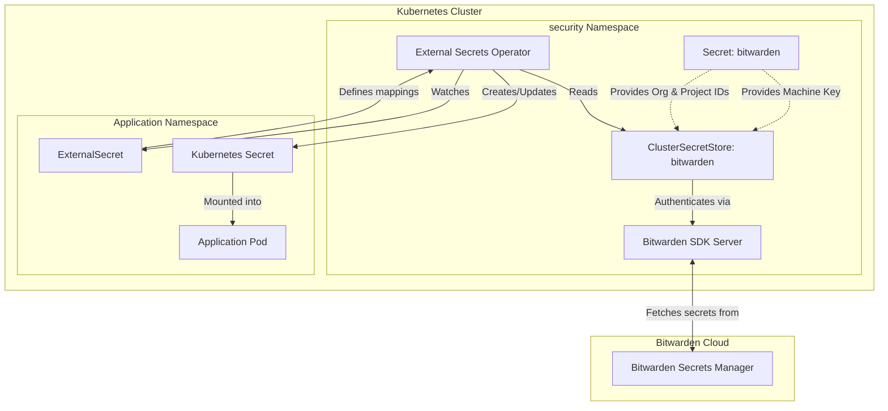

# External Secrets

This directory configures [External Secrets Operator](https://external-secrets.io/) to securely fetch secrets from **Bitwarden Secrets Manager (BWS)** and sync them into Kubernetes Native `Secret` resources.

## Architecture



## Prerequisites

Before this Kustomization can successfully apply and become healthy, certain manual prerequisites must be met.

The `ClusterSecretStore` and the Flux Kustomization rely on a pre-existing Kubernetes Secret containing the necessary authentication details for Bitwarden Secrets Manager.

### 1. Create the Bitwarden Secret

You must create a SOPS-encrypted Secret or a manual Opaque Secret named `bitwarden` in the `security` namespace.

This secret **must** contain the following keys:

1. `BITWARDEN_MACHINE_KEY`: The access token/machine key generated from the Bitwarden Secrets Manager web vault.
2. `BITWARDEN_ORGANIZATION_ID`: The UUID of your Bitwarden organization.
3. `BITWARDEN_PROJECT_ID`: The UUID of the specific Bitwarden project ESO should have access to.

**Example Secret Manifest (needs to be SOPS encrypted or applied manually):**

```yaml
apiVersion: v1
kind: Secret
metadata:
  name: bitwarden
  namespace: security
type: Opaque
stringData:
  BITWARDEN_MACHINE_KEY: "xxxxxxxxx-xxxx-xxxx-xxxx-xxxxxxxxxxxx"
  BITWARDEN_ORGANIZATION_ID: "xxxxxxxx-xxxx-xxxx-xxxx-xxxxxxxxxxxx"
  BITWARDEN_PROJECT_ID: "xxxxxxxx-xxxx-xxxx-xxxx-xxxxxxxxxxxx"
```

> **Note:** Flux uses `postBuild.substituteFrom` to inject the Organization ID and Project ID directly into the `ClusterSecretStore` manifest upon reconciliation, while the `BITWARDEN_MACHINE_KEY` is referenced natively by the store.

### 2. Certificate Generation

The Bitwarden SDK server requires mutual TLS or secure communication. The `app.ks.yaml` expects a cert-manager `Certificate` named `bitwarden-tls-certs` to be created (which in turn generates a secret containing a `ca.crt`). Ensure your PKI/Issuer is correctly configured to fulfill this certificate request.

## Usage

To use this store in your applications, create an `ExternalSecret` resource in the application's namespace and reference the `ClusterSecretStore` named `bitwarden`.

**Example:**

```yaml
apiVersion: external-secrets.io/v1
kind: ExternalSecret
metadata:
  name: my-app-secret
spec:
  refreshInterval: 1h
  secretStoreRef:
    kind: ClusterSecretStore
    name: bitwarden
  target:
    name: my-app-secret # The name of the Kubernetes Secret to be created
    creationPolicy: Owner
  dataFrom:
    - extract:
        key: my_bws_secret_identifier # The name of the secret in Bitwarden Secrets Manager
```

### Advanced Usages (Templating)

You can also use templating to map individual fields or generate complex configuration files from Bitwarden secrets, as demonstrated in the PgAdmin deployment:

```yaml
  target:
    template:
      data:
        config.json: |
          {
            "username": "{{ .MY_USERNAME }}",
            "password": "{{ .MY_PASSWORD }}"
          }
  data:
    - secretKey: MY_USERNAME
      remoteRef:
        key: app_credentials
        property: username
```
