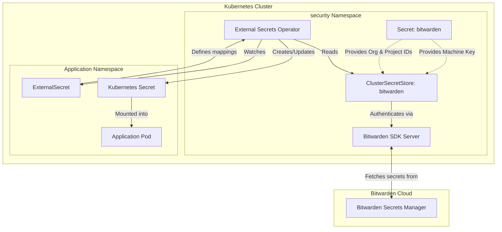

# External Secrets

This directory configures [External Secrets Operator](https://external-secrets.io/) to securely fetch secrets from **Bitwarden Secrets Manager (BWS)** and sync them into Kubernetes Native `Secret` resources.

## Architecture



## Prerequisites

Before this Kustomization can successfully apply and become healthy, certain manual prerequisites must be met in both Bitwarden Secrets Manager and your SOPS secrets.

### 1. Bitwarden Secrets Manager Setup

1. **Create a Project:** In the Bitwarden Secrets Manager web vault, create a project (e.g., `bitwarden`). Note the Project ID (UUID) from the URL or project settings.
2. **Create a Machine Account:** Create a machine account (e.g., `kubernetes-eso`).
3. **Grant Project Access:** Under the Machine Account's **Projects** tab, add your newly created project and grant it **Read** access. *(If you skip this step, ESO will silently receive empty lists and fail to find secrets!)*
4. **Generate an Access Token:** Generate an Access Token for the machine account. This will be your `BITWARDEN_MACHINE_KEY`.
5. **Retrieve IDs:** Get your Organization ID from the vault and the Project ID for the project you created.

### 2. Create the SOPS-Encrypted Kubernetes Secret

You must create a SOPS-encrypted Secret (e.g., `secrets.sops.yaml` in the `stores/` directory) that will be deployed as `bitwarden` in the `security` namespace.

This secret **must** contain the following exact keys:

1. `BITWARDEN_MACHINE_KEY`: The access token generated from the BWS machine account.
2. `BITWARDEN_ORGANIZATION_ID`: The full 36-character UUID of your Bitwarden organization.
3. `BITWARDEN_PROJECT_ID`: The full 36-character UUID of the specific Bitwarden project.

**Example unencrypted SOPS Secret Manifest:**

```yaml
apiVersion: v1
kind: Secret
metadata:
  name: bitwarden
  namespace: security
type: Opaque
stringData:
  BITWARDEN_MACHINE_KEY: "xxxxxxxxx-xxxx-xxxx-xxxx-xxxxxxxxxxxx"
  BITWARDEN_ORGANIZATION_ID: "xxxxxxxx-xxxx-xxxx-xxxx-xxxxxxxxxxxx"
  BITWARDEN_PROJECT_ID: "xxxxxxxx-xxxx-xxxx-xxxx-xxxxxxxxxxxx"
```

> **Note:** Flux uses `postBuild.substituteFrom` to inject the Organization ID and Project ID directly into the `ClusterSecretStore` manifest upon reconciliation, while the `BITWARDEN_MACHINE_KEY` is referenced natively by the store.

### 3. Certificate Generation

The Bitwarden SDK server requires mutual TLS or secure communication. The `app.ks.yaml` expects a cert-manager `Certificate` named `bitwarden-tls-certs` to be created. In this setup, a `SelfSigned` issuer named `bitwarden-selfsigned-issuer` automatically bootstraps this certificate.

## Testing External Secrets

To verify that External Secrets is correctly authenticating to Bitwarden and can fetch secrets:

### 1. Create a Test Secret in Bitwarden

In your BWS project (e.g., `bitwarden`), create a new Secret.
- **Name:** `bitwarden-test`
- **Value:** Store any simple text or JSON value, for example:
  ```json
  {
    "TEST_KEY": "Hello World"
  }
  ```

### 2. Apply a Test ExternalSecret

Create and apply a file named `external-secret-test.yaml`:

```yaml
apiVersion: external-secrets.io/v1
kind: ExternalSecret
metadata:
  name: bitwarden-test
  namespace: security
spec:
  secretStoreRef:
    kind: ClusterSecretStore
    name: bitwarden
  target:
    name: bitwarden-test-secret # The native Kubernetes Secret to be created
  dataFrom:
    - extract:
        key: bitwarden-test # The name of the secret in Bitwarden
```

Apply it to the cluster:
```shell
kubectl apply -f external-secret-test.yaml
```

### 3. Validate Synchronization

Check that the ExternalSecret synced successfully:
```shell
kubectl get externalsecret -n security bitwarden-test
```
You should see status `True` and `Reason: SecretSynced`.

Check that the native Kubernetes Secret was created and contains the mapped keys:
```shell
kubectl get secret -n security bitwarden-test-secret -o json | jq '.data | keys'
```
This should output your extracted keys:
```json
[
  "TEST_KEY"
]
```

## Advanced Usage (Templating)

You can use templating to map individual fields or generate complex configuration files from Bitwarden secrets:

```yaml
apiVersion: external-secrets.io/v1
kind: ExternalSecret
metadata:
  name: my-app-secret
  namespace: default
spec:
  refreshInterval: 1h
  secretStoreRef:
    kind: ClusterSecretStore
    name: bitwarden
  target:
    name: my-app-secret
    template:
      data:
        config.json: |
          {
            "username": "{{ .MY_USERNAME }}",
            "password": "{{ .MY_PASSWORD }}"
          }
  data:
    - secretKey: MY_USERNAME
      remoteRef:
        key: app_credentials
        property: username
```
